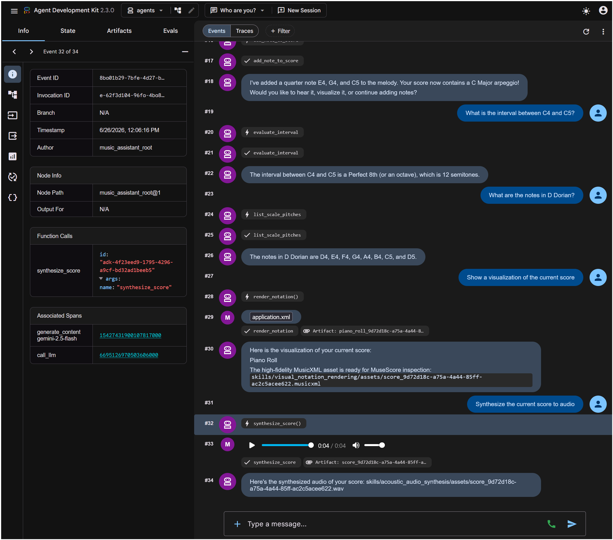
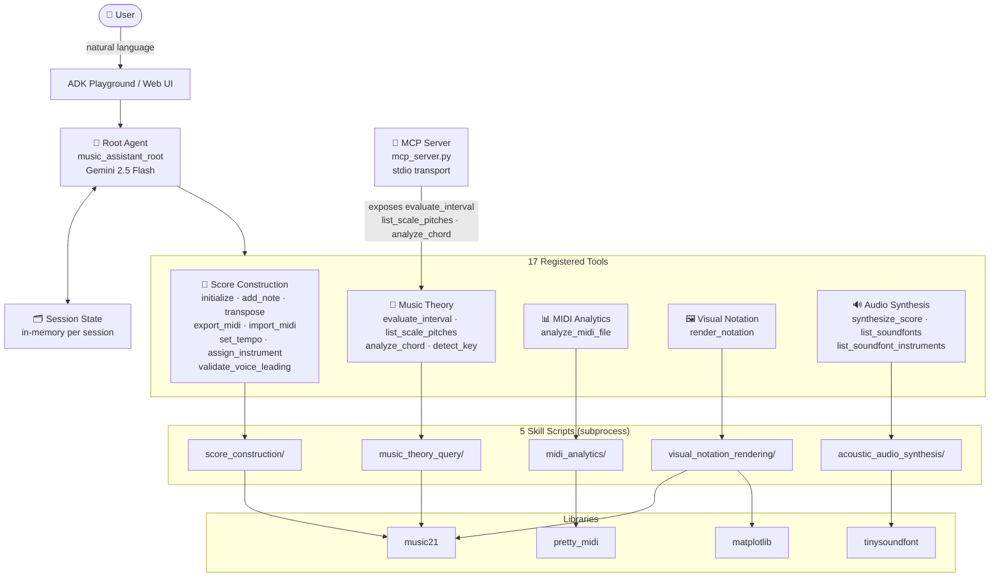

# 🎵 Cadence AI Music Assistant

> **Kaggle Capstone — Agents for Good track**  
> AI Agents: Intensive Vibe Coding Course with Google

[](https://www.python.org/) [](https://adk.dev/) [](LICENSE)

**Quick links:** [📺 Demo Video (YouTube)](#-todo) · [🌐 Live Demo](#-todo) · [💻 GitHub](https://github.com/esoltys/cadence-music-assistant)



---

## 🎯 The Problem

Musicians and students have a cadence to their creative work — a rhythm of thinking, experimenting, and refining. That cadence breaks every time they have to stop and switch tools.

- **Theory questions interrupt the flow.** "What chord is this?" "What scale fits here?" "What interval is that?" — questions that should take seconds instead mean opening a textbook, searching YouTube, or loading a separate app.
- **The gap between idea and audio is wide.** Turning a musical idea into something you can actually *hear* means setting up a DAW, finding a soundfont, configuring a MIDI editor — a barrier that stops many ideas before they start.
- **Nothing shares context.** You analyze theory in one app, compose in another, render notation in a third, and synthesize audio in a fourth. Every tool switch means starting over with no memory of what came before.

For students in formal music theory courses, there's an additional friction: writing four-part harmony exercises by hand means manually scanning for voice-leading errors (parallel fifths, octaves, range violations) — tedious work that eats time that could be spent actually learning.

AI agents are uniquely positioned to solve this because music tasks are inherently **multi-step and stateful**. A conversational agent can hold context across an entire creative session — no tool switching, no lost state, no broken cadence.

---

## 💡 The Solution

**Cadence** is a conversational AI agent that keeps musicians and students in their creative flow. Ask a theory question, build a score, visualize it, and hear it — all in one conversation, with no tool switching.

- Ask theory questions — intervals, chords, scales, key detection — and get instant, accurate answers
- Build multi-part musical scores note by note, or import existing MIDI files
- Hear your composition as a synthesized WAV in seconds, with your choice of soundfont
- Visualize your score as a piano roll or export MusicXML for MuseScore
- For theory students: validate voice-leading rules (parallel fifths, octaves, vocal ranges) automatically

**Why agents?** Because music tasks are multi-step and contextual — and maintaining cadence means never losing the thread. When a user says _"I have a melody idea — let me build it, check what key it suggests, visualize it, then hear it"_, they're describing a **pipeline of 4–5 tool calls** that must share session state. A conversational agent with working memory is the only tool that can follow you through that without breaking your flow.


---

## 🏗️ Architecture



### Technology Stack

| Layer | Technology |
|---|---|
| **Agent Framework** | [Google Agent Development Kit (ADK)](https://adk.dev/) v2.3+ |
| **LLM** | Gemini 2.5 Flash (via `google-adk`) |
| **Music Engine & Score Export** | [music21](https://web.mit.edu/music21/) v9.1+ — music analysis, composition, and MusicXML export |
| **MIDI Processing** | [pretty_midi](https://craffel.github.io/pretty-midi/) v0.2+ |
| **Audio Synthesis** | [tinysoundfont](https://github.com/nwhitehead/tinysoundfont) + General MIDI soundfonts |
| **Visualization** | [matplotlib](https://matplotlib.org/) v3.8+ — piano rolls and score timeline plots |
| **MCP Server** | [FastMCP](https://github.com/jlowin/fastmcp) (stdio transport) |
| **Web API** | FastAPI via `google.adk.cli.fast_api` |
| **Observability** | OpenTelemetry → Cloud Trace + Cloud Logging |
| **Container** | Docker (Python 3.12 slim) |
| **Deploy** | Google Cloud Run via `agents-cli deploy` |

---

## ✅ Key Concepts Demonstrated

The following concepts from the "AI Agents: Intensive Vibe Coding Course" are demonstrated in this project:

| Concept | Status | Where |
|---|---|---|
| **Agent / Multi-agent system (ADK)** | ✅ | [`agents/music_assistant/agent.py`](agents/music_assistant/agent.py) — `root_agent = Agent(...)` with 17 registered tools |
| **Agent Skills (agents-cli)** | ✅ | 5 skill directories under `skills/`, `agents-cli-manifest.yaml`, full `eval/playground/deploy` workflow |
| **MCP Server** | ✅ | [`mcp_server.py`](mcp_server.py) — exposes 3 music theory tools via stdio MCP for external clients |
| **Security features** | ✅ | Path traversal guard (`_safe_resolve_path`), input length caps (`_sanitize_arg`), CORS control, session isolation, privacy-preserving telemetry |
| **Deployability** | ✅ | `Dockerfile`, Cloud Run deployment via `agents-cli deploy`, Terraform scaffold available |
| **Antigravity** | ✅ | Used throughout development — see [`GEMINI.md`](GEMINI.md) and video demo |

---

## 🔒 Security

Security is designed in at multiple layers:

| Feature | Implementation |
|---|---|
| **No secrets in code** | All credentials via environment variables; `.gitignore` excludes `.env`, `*.db`, all session artifacts |
| **Path traversal prevention** | `_safe_resolve_path()` in [`agent.py`](agents/music_assistant/agent.py) resolves any LLM-supplied file path and asserts it stays within the project root |
| **Input length caps** | `_sanitize_arg()` truncates all string subprocess arguments to 256 chars, preventing oversized inputs |
| **No shell injection** | All subprocess calls use list argv (`shell=False`); no user-supplied strings are concatenated into shell commands |
| **Soundfont directory restriction** | `synthesize_score` strips all directory components from user-supplied soundfont names via `Path(name).name`, ensuring only files inside `soundfonts/` can be loaded |
| **Session isolation** | `session_service_uri=None` (in-memory sessions); no cross-session data persistence |
| **Privacy-preserving telemetry** | `telemetry.py` hard-codes `NO_CONTENT` mode — metadata only, no prompt/response content is ever logged |
| **CORS control** | `ALLOW_ORIGINS` configured via environment variable; defaults to locked-down if unset |

---

## 🖼️ Gallery

> [!IMPORTANT]
> **TODO:** Replace with high-quality screenshots before submission.
> Capture and add:
> - `examples/screenshot_playground_session.png` — a full ADK playground conversation showing score building + theory query in one session
> - `examples/screenshot_piano_roll.png` — a rendered piano roll of a multi-part score with clear labels
> - `examples/screenshot_musicxml.png` — the MusicXML output open in MuseScore
> - `examples/screenshot_audio_wave.png` — the synthesized WAV loaded in an audio viewer
> - `examples/diagram_architecture.png` — an exported version of the Mermaid architecture diagram above

---

## 🎵 What Can the Assistant Do? (User Guide)

The assistant gives you an **interactive music education and composition environment** through plain conversation. All five skill areas share a live session state — notes you build in one step are immediately available to transpose, visualize, validate, or synthesize in the next.

### End-to-End Workflow Example

Here is a complete session a music student or composer might have:

```
You:       "Initialize a 3/4 waltz in A Minor."
Agent:     Score initialized — 3/4, A Minor, 0 parts.

You:       "Add these melody notes: A4 quarter, C5 quarter, E5 half."
Agent:     Added 3 notes to the 'melody' part (measure 1).

You:       "What chord do A4, C5, and E5 form?"
Agent:     A Minor triad (root position). Roman numeral: i in A Minor.

You:       "Check the score for voice-leading errors."
Agent:     No parallel fifths or octaves detected. Vocal ranges OK.

You:       "Render a piano roll of the melody."
Agent:     [displays piano roll image]

You:       "Transpose the score up a perfect fifth and synthesize it."
Agent:     Transposed +7 semitones → E Minor. Synthesizing… [score.wav ready]
```

All of this happens in a single conversation with no file management, no software switching, and no music theory lookup required.

---

### Skill 1 — Score Construction & Composition

Build, edit, and export musical scores. The agent maintains your **active score state** across the entire session.

| Capability | Example prompt |
|---|---|
| Initialize a score | *"Create a blank 4/4 score in G Major."* |
| Add notes, chords, rests | *"Add a dotted quarter C4, then an eighth rest to the melody."* |
| Build multi-part scores | *"Add a bassline part and put a whole note G2 on measure 1."* |
| Set tempo | *"Set the tempo to 120 BPM."* |
| Assign instruments | *"Assign the bassline part to Acoustic Bass (program 32)."* |
| Transpose | *"Transpose the score up a minor third."* |
| Validate voice-leading | *"Check for parallel fifths and octaves."* |
| Export MIDI | *"Export the score as a MIDI file."* |
| Import MIDI | *"Import the attached MIDI file into the active score."* |

### Skill 2 — Music Theory Queries

Get instant, accurate answers to theory questions — the kind that used to require a textbook or a teacher.

| Capability | Example prompt |
|---|---|
| Interval calculation | *"What is the interval between C4 and G#4?"* |
| Scale spelling | *"List the notes in D Dorian."* |
| Scale modes | *"What notes are in F# Phrygian?"* |
| Chord identification | *"What chord is C4, E♭4, G4, B♭4?"* |
| Roman numeral analysis | *"What is the Roman numeral for C4, E4, G4 in G Major?"* |

### Skill 3 — MIDI File Analytics

Drop any MIDI file into the chat and instantly understand its structure.

| Capability | Example prompt |
|---|---|
| Track & note summary | *"Analyze this MIDI: how many tracks and notes does it have?"* |
| Tempo & time signature | *"What is the tempo and time signature of this MIDI?"* |
| Instrument listing | *"What instruments are used in this file?"* |
| Key detection | *"What key does this MIDI seem to be in?"* |

### Skill 4 — Visual Notation Rendering

Turn your active score into visual artifacts for learning, sharing, or further editing.

| Output | Example prompt |
|---|---|
| Piano roll image | *"Show me a piano roll of the current score."* |
| Score timeline plot | *"Render the active score as a timeline graph."* |
| MusicXML export | *"Export the score as MusicXML for MuseScore."* |
| Filtered render | *"Render only the melody and bassline tracks."* |

### Skill 5 — Acoustic Audio Synthesis

Hear what you've built, without opening a DAW.

| Capability | Example prompt |
|---|---|
| Full score to WAV | *"Synthesize the current score to audio."* |
| Single track | *"Play just the melody track."* |
| Choose soundfont | *"Synthesize using the Salamander Grand Piano soundfont."* or *"Use the General MIDI soundfont."* |
| Browse soundfonts | *"What soundfonts are available?"* |
| Browse instruments | *"What instruments does the General MIDI soundfont include?"* |

### Complete Tool Inventory

The agent has 17 registered tools across the 5 skill areas:

| Tool | Skill Area |
|---|---|
| `initialize_score` | Score Construction |
| `add_note_to_score` | Score Construction |
| `transpose_score` | Score Construction |
| `set_score_tempo` | Score Construction |
| `assign_instrument_to_track` | Score Construction |
| `validate_voice_leading` | Score Construction |
| `export_score_to_midi` | Score Construction |
| `import_midi_to_score` | Score Construction |
| `evaluate_interval` | Music Theory |
| `list_scale_pitches` | Music Theory |
| `analyze_chord` | Music Theory |
| `detect_key` | Music Theory |
| `analyze_midi_file` | MIDI Analytics |
| `render_notation` | Visual Notation |
| `synthesize_score` | Audio Synthesis |
| `list_soundfonts` | Audio Synthesis |
| `list_soundfont_instruments` | Audio Synthesis |

---

## 🛠️ Developer Guide

### Project Structure

```
cadence-music-assistant/
├── app/                           # FastAPI application and telemetry wrappers
│   └── app_utils/                 # Telemetry and typing helpers
├── agents/                        # ADK agent package
│   ├── agent.py                   # Wrapper to expose music assistant agent
│   └── music_assistant/           # Core agent: 17 tools + security helpers
├── skills/                        # 5 custom skill script directories
│   ├── score_construction/        # Score build, edit, export, validate
│   ├── music_theory_query/        # Intervals, scales, chords, key detection
│   ├── midi_analytics/            # MIDI file parsing
│   ├── visual_notation_rendering/ # Piano roll + MusicXML generation
│   └── acoustic_audio_synthesis/  # WAV synthesis via tinysoundfont
├── mcp_server.py                  # MCP server (music theory tools, stdio)
├── tests/                         # Unit and integration tests
├── specs/                         # BDD feature specs + test implementations
├── Dockerfile                     # Container for Cloud Run deployment
├── GEMINI.md                      # AI-assisted development guide (Antigravity)
└── pyproject.toml                 # Project dependencies
```

> 💡 **Tip:** Use [Google Antigravity](https://antigravity.google/) for AI-assisted development — project context is pre-configured in [GEMINI.md](GEMINI.md).

### Requirements

Before you begin, ensure you have:
- **uv**: Python package manager — [Install](https://docs.astral.sh/uv/getting-started/installation/)
- **agents-cli**: Install with `uv tool install google-agents-cli`
- **Google Cloud SDK**: For GCP services — [Install](https://cloud.google.com/sdk/docs/install)

### Quick Start

```bash
uvx google-agents-cli setup
agents-cli install
agents-cli playground
```

You can also use the [ADK](https://adk.dev/) CLI directly with `uv run adk`.

### Commands

| Command | Description |
| --- | --- |
| `agents-cli install` | Install dependencies using uv |
| `agents-cli playground` | Launch local development environment |
| `agents-cli lint` | Run code quality checks |
| `agents-cli eval` | Evaluate agent behavior (generate, grade, analyze — see `agents-cli eval --help`) |
| `uv run pytest tests/unit tests/integration` | Run unit and integration tests |

### MCP Server

The project includes an MCP server (`mcp_server.py`) that exposes the full suite of music theory, score construction, MIDI analytics, notation rendering, and audio synthesis tools over the stdio transport. This allows external MCP clients—such as Claude Desktop or other ADK agents—to call the music engine directly.

**Run the server:**
```bash
uv run python mcp_server.py
```

**Adding to Claude Desktop:**

You can integrate Cadence directly into Claude Desktop. Open your Claude Desktop configuration file:
* **Windows:** `%APPDATA%\Claude\claude_desktop_config.json`
* **macOS:** `~/Library/Application Support/Claude/claude_desktop_config.json`

Add the following entry to the `mcpServers` block:

```json
{
  "mcpServers": {
    "cadence-music-assistant": {
      "command": "uv",
      "args": [
        "--directory",
        "<absolute-path-to-cadence-music-assistant>",
        "run",
        "python",
        "mcp_server.py"
      ],
      "env": {
        "CADENCE_ALLOWED_PATHS": "<optional-custom-music-directories>"
      }
    }
  }
}
```

*Replace `<absolute-path-to-cadence-music-assistant>` with the actual absolute path to this project directory on your local machine (using double backslashes `\\` on Windows).*

* **Attachment-Driven Ingestion:** To ensure maximum sandboxing, safety, and compatibility with clients running in isolated container/VM environments, the tools `analyze_midi_file`, `detect_key`, and `import_midi_to_score` do not accept raw host-level file paths. Instead, they accept a structured `file_attachment` parameter mapping:
  ```json
  {
    "fileName": "string",
    "mimeType": "string",
    "base64Data": "string"
  }
  ```
  This allows host clients (like Claude Desktop or the ADK runner) to feed chat attachments directly into the tool context as clean base64 data.
* **Exposed MCP Resources:** To retrieve generated scores, rendering plots, and synthesized audio files directly via the MCP protocol, the server exposes the following dynamic resource templates (replacing `{session_id}` with the unique score session ID, e.g. `default`):
  - `music://scores/{session_id}/score.mid` (MIME: `audio/midi`) - The exported MIDI score.
  - `music://scores/{session_id}/score.musicxml` (MIME: `application/xml`) - The MusicXML sheet music.
  - `music://scores/{session_id}/piano_roll.png` (MIME: `image/png`) - Rendered piano roll visualization.
  - `music://scores/{session_id}/score_plot.png` (MIME: `image/png`) - Rendered notation timeline graph.
  - `music://scores/{session_id}/score.wav` (MIME: `audio/wav`) - Synthesized WAV audio file.


### 🛠️ Project Management

| Command | What It Does |
|---------|--------------|
| `agents-cli scaffold enhance` | Add CI/CD pipelines and Terraform infrastructure |
| `agents-cli infra cicd` | One-command setup of entire CI/CD pipeline + infrastructure |
| `agents-cli scaffold upgrade` | Auto-upgrade to latest version while preserving customizations |

### Development

Edit your agent logic in `agents/music_assistant/agent.py` and test with `agents-cli playground` — it auto-reloads on save.

### Deployment

This project is fully containerized and deploys to **Google Cloud Run** via `agents-cli deploy`.

```bash
gcloud config set project <your-project-id>
agents-cli deploy
```

#### Cloud Run Cost Controls

Cloud Run charges only for active request processing time — with zero traffic, the cost is effectively $0. Recommended settings to prevent runaway costs:

| Setting | Recommended Value | How to Set |
|---|---|---|
| **Max instances** | `3` | `--max-instances=3` in deploy cmd or Cloud Console |
| **Min instances** | `0` | Default; allows scale-to-zero when idle |
| **Memory** | `512Mi–1Gi` | `--memory=512Mi` |
| **CPU** | `1` | `--cpu=1` |
| **Request timeout** | `60s` | `--timeout=60` |
| **Concurrency** | `10` | `--concurrency=10` |

With these limits and a pre-pay billing cap in place, costs for judging-level traffic (a few dozen requests) will be well under $1.

To add CI/CD and Terraform: `agents-cli scaffold enhance`  
To set up production infrastructure: `agents-cli infra cicd`

### Observability

Built-in telemetry exports to Cloud Trace, BigQuery, and Cloud Logging. Prompt/response content is **never logged** — only metadata (latency, token counts) is captured.

---

## 📋 TODO

> [!IMPORTANT]
> The following items are outstanding and required for the final Kaggle submission:

- [ ] **🎬 YouTube Demo Video** (≤ 5 min, required for submission)
  - Record walkthrough: problem statement → architecture → live demo → build process
  - Upload to YouTube (public or unlisted) and update the link at the top of this README
- [ ] **🌐 Live Demo URL** — run `agents-cli deploy` and update the link at the top of this README
